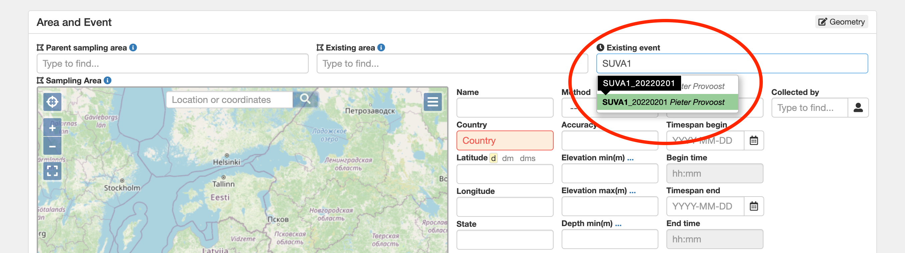
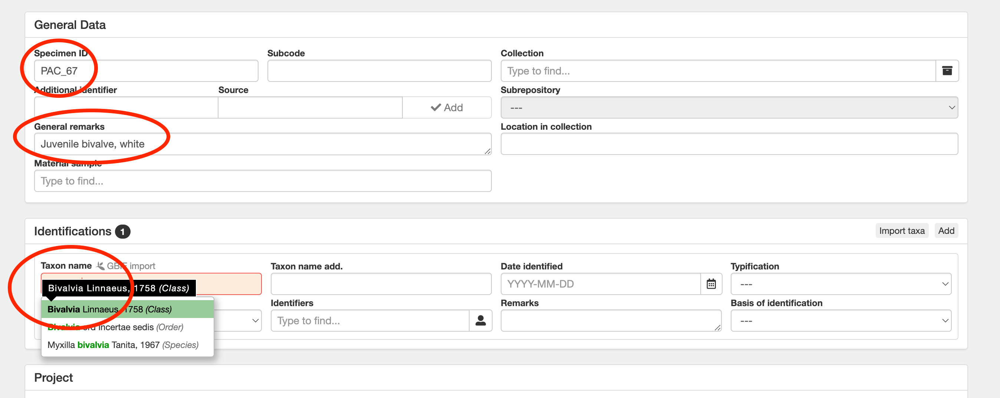

# PlutoF data entry

All PacMAN data is managed under the [PacMAN project in PlutoF](https://app.plutof.ut.ee/study/view/98281).

## Material samples and sampling events

Material samples (water samples, plankton samples, and individual settlement plates), as well as the sampling events they belong to can be entered through the Material Sample form. On the [project page](https://app.plutof.ut.ee/study/view/98281), go to the Related Records panel, navigate to Material Samples, and click New.

In the Form panel, select Default.

The Area and Event panel allows you to either (1) select an existing sampling event or (2) create a new sampling event linked to an existing area.

### Existing sampling event

To use an existing sampling event, enter the event name in Existing event.

### New sampling event

To create a new sampling event, first select an existing area (sampling station):

Next select or create a sampling event. Sampling events should follow the following naming pattern (station and date seperated by underscore): `SUVA1_20220304`. Enter the event name, date, and time.

### Samples

Next enter the samples in the Material Samples panel. Sample names should follow the following patterns:

- `SUVA1_20220304_WA` (water replicate A)
- `SUVA1_20220304_PA` (plankton replicate A)
- `SUVA1_20220304_S1A` (settlement plate series 1 plate A)

Select the appropriate sample type.

## Specimens

To enter voucher specimens, go back to the project page, and then to the appropriate material sample (for example, `SUVA1_20220201_S1A`).

In the Related Records panel, create a new specimen.

In the first panel of the form, select Default.

In the General panel, enter the voucher identifier and any remarks. At USP the identifier follows the following pattern: `PAC_123`. Under Identification, select the taxonomic name.

Save the specimen.

## Environmental measurements

To add environmental measurements to a sampling event, we will need to create three material samples, one for each depth.

From the sampling event page, click New in the Material Samples panel and select the `PacMAN environmental measurements` form.

Create a material sample for each sampling depth. Use the following sample naming pattern: `SUVA1_20220201_ENV1` and select Water as the sample type.

## DNA extractions

To document.

## PCR

To document.

## Sequencing

To document. After sequencing results have been added, an automated pipeline will take over.
